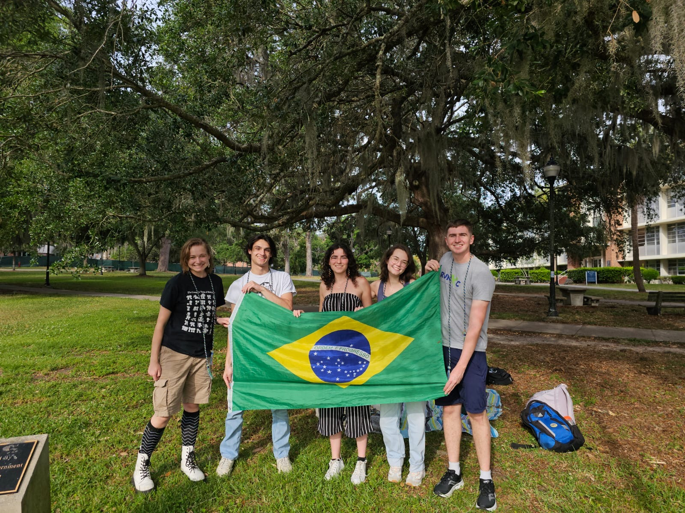
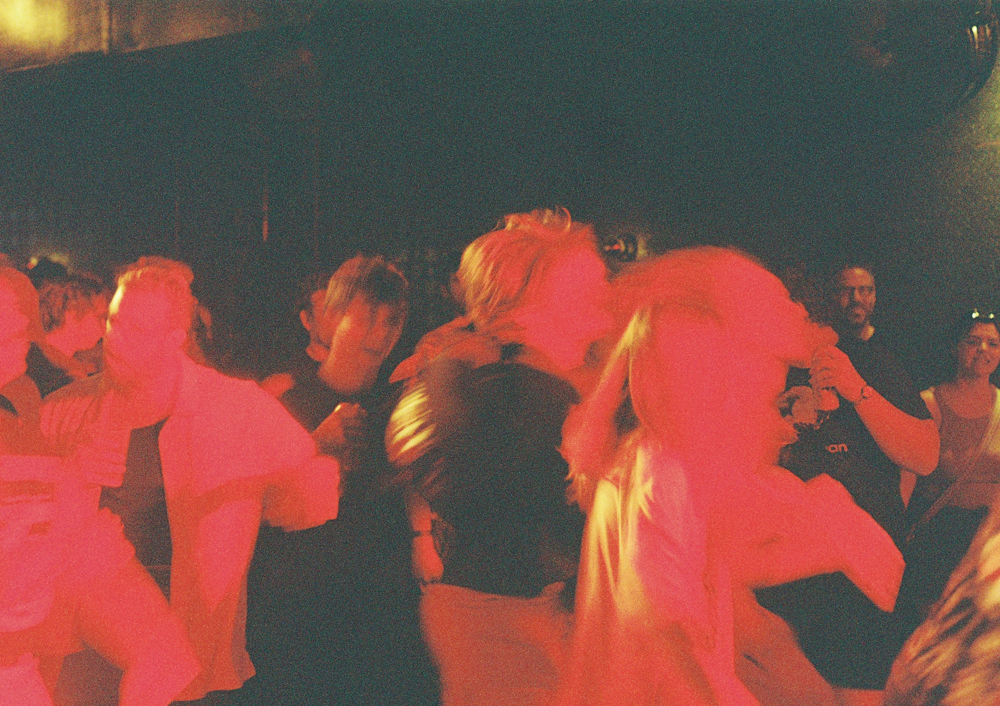

# Christian Scaff (*λPL. love PL*)
## I like to compute on the occasion.

Hello! I'm a Master's student at Columbia University studying computer science. My research focuses on formal methods and neuro-symbolic AI.

**Currently working on:**
1. Working on making FPGA engineering more accessible for software people like myself.

**Past Research Contributions:**

[PALS: Preference-guided Active Automata Learning for Symbolic Reinforcement Learning in Games](https://openreview.net/forum?id=jRUJpASPQJ&referrer=%5Bthe%20profile%20of%20Christian%20Scaff%5D(%2Fprofile%3Fid%3D~Christian_Scaff1))
*William Fishell, Christian Scaff, Sam Nicholas Kouteili, Mark Santolucito* **(ICML 2026 Workshop)**

[Mining Beyond the Bools: Learning Data Transformations and Temporal Specifications](https://arxiv.org/abs/2603.06710)
*Sam Nicholas Kouteili, William Fishell, Christian Scaff, Mark Santolucito, Ruzica Piskac* **(ESOP 2027)**

**Open-Source Contributions:**

[Manhattan Reasoning Gym](https://manhattanreasoning.com/#top) — Accessible Cloud Compute for Agentic RTL Development.

[Wyvern Graph](https://github.com/cscaff/Wyvern-Graph) — An LLVM IR to Knowledge Graph Translator.

[AlgebraicJulia](https://github.com/AlgebraicJulia) — An ecosystem of software based on generalized algebra and category theory in Julia.
- [ACSets.jl](https://github.com/AlgebraicJulia/ACSets.jl)
- [AlgebraicOptimization.jl](https://github.com/AlgebraicJulia/AlgebraicOptimization.jl)
- [Catlab.jl](https://github.com/AlgebraicJulia/Catlab.jl)
- [DiagrammaticEquations.jl](https://github.com/AlgebraicJulia/DiagrammaticEquations.jl)

---

**CV:** [Christian_Scaff_CV_2026.pdf](Christian_Scaff_CV_2026.pdf)

---

## About me!

I was a Portuguese Studies minor in undergrad. Here's me at the last Bate Papo meeting of Spring '25.

  

I also love concert photography. <a href="https://christianscaff.com">Check out my work here 🎞️.</a>

  <em>Portra 800 Pushed 1 Stop</em> 
   
  <em>Lip Critic's June '24 show at the Subterranean in Chicago</em>

---

   
  <em>That's the end of my page. Sorry :\</em>

  <b>🎧 Currently Listening to...</b> 
  

